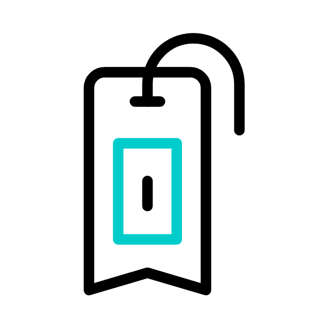

# BookMark_Tracker A Chrome Extension

## **Live Link** : - [Click here](https://bookmark-tracker-ab.netlify.app/)

> 1. Developed a Google Chrome extension that allows users to save and track bookmarked URLs.
> 2. Utilized Local Storage to persist the bookmarked URLs even after the browser is closed or the computer is turned off.
> 3. Implemented a browser action that captures the URL of the currently active tab and adds it to the list of bookmarked URLs.
> 4. Included a feature that allows users to delete a specific link by right-clicking on it and confirming the deletion with an alert message.
> 5. Built using JavaScript and HTML, with a focus on user experience and data management.

## How to initialize it in your system:-

1. Download the project and save the file in your system
2. Go to Google Chrome Settings > Extensions > Enable the Developer mode > Load unpacked > Select the file.
3. The Extension will be added to the dashboard.

## Key Takeaways:-

> - Experience in building a Google Chrome extension and utilizing chrome API's to interact with the current tabs.
> - Understanding of Local Storage and how it can be used to persist data.
> - Knowledge of event listeners and how they can be used to capture user input and interact with the DOM.
> - Understanding of browser extension development and the requirements for creating a functional and user-friendly extension.
> - Understanding of the manifest.json file and how it is used to configure an extension's properties, including its name, version, icons, permissions, and other settings.
> - Knowledge of the different fields in the manifest.json file and how they are used, such as manifest_version, version, name, action, and permissions
